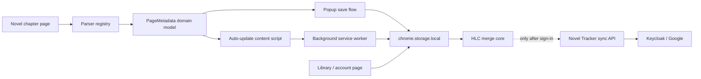

# Novel Tracker Extension

Novel Tracker is a local-first Manifest V3 browser extension for saving and
automatically updating web novel and light novel reading progress across chapter
sites.

It keeps a small reading library in the browser, lets readers reopen the exact
chapter where they stopped, and keeps chapter history so accidental backtracking
can be corrected.

## Features

- Save the current chapter URL from the active browser tab.
- Capture novel title, source site, chapter label, cover image URL, and reading status.
- Automatically update tracked novels when matching chapter URLs change.
- Browse, search, sort, edit, delete, and reopen novels from the library page.
- Keep a per-novel chapter history trail.
- Export and import JSON backups.
- Work without an account and keep reading data local to the browser profile.
- Optionally sign in with Google to synchronize through the Novel Tracker API.
- Resolve offline changes with deterministic HLC/remove-wins merge rules.

## Supported Site Profiles

Novel Tracker includes site-specific parsers for:

- Royal Road
- Patreon
- Wuxiaworld
- NovelBin
- ScribbleHub
- Creative Novels
- Light Novels Translations
- Shin Translations
- Chikari

Other sites fall back to generic page metadata and can still be saved manually.
NovelUpdates is useful for discovery, but it is not treated as a reading source
because it indexes releases rather than hosting chapters.

## Privacy Policy

Novel Tracker is designed as a local-first reading tracker.

Data handled by the extension:

- Chapter URLs you save or visit for tracked novels.
- Novel titles, chapter labels, source site hostnames, cover image URLs, reading status, and chapter history timestamps.
- JSON backup files that you explicitly export or import.

How data is used:

- Reading data is used only to provide the extension's single purpose: tracking where you stopped reading web novels and reopening those pages later.
- Reading data is stored in `chrome.storage.local` in your browser profile.
- The extension does not require an account, run ads, use analytics, or sell data.
- When the reader explicitly signs in with Google, Novel Tracker transmits the
  library and chapter history to `api.novel.bghimire.com` for synchronization.
- Google and Keycloak process account authentication; Google credentials are
  never exposed to the extension or Novel Tracker API.
- Signing out stops synchronization and retains the local library.
- Exported JSON backups are created only when you click `Export JSON`; imported backups are read only when you choose a local JSON file.

Permissions:

- `storage`: stores the reading library locally.
- `tabs` and `activeTab`: reads the active tab URL/title when saving progress from the popup.
- `scripting`: injects the shared parser into the active page so the popup can read chapter metadata.
- `identity`: opens the optional Google/Keycloak PKCE sign-in flow.
- `alarms`: retries optional synchronization periodically while signed in.
- Supported-site host permissions: allow automatic progress updates only on the supported HTTPS novel sites listed above. The popup can still use `activeTab` when you explicitly open it on the current page.

Limited Use statement:

Novel Tracker's use of information received from browser APIs adheres to the
Chrome Web Store User Data Policy, including the Limited Use requirements.

## Architecture



The parsing layer normalizes each page into a shared `PageMetadata` shape:

```js
{
  title,
  sourceSite,
  novelHomeUrl,
  lastReadChapterUrl,
  lastReadChapterLabel,
  coverImageUrl
}
```

Business logic in `storage.js` works against this domain model instead of
site-specific DOM details.

## Repository Layout

```text
src/
  manifest.json
  popup.html / popup.js
  options.html / options.js
  background.js
  content-script.js
  lib/
    parser-core.js
    page-metadata.js
    storage.js
    site-parsers/
      royalroad.js
      patreon.js
      wuxiaworld.js
      novelbin.js
      scribblehub.js
      creativenovels.js
      lightnovelstranslations.js
      shintranslations.js
scripts/
  build.mjs
  generate-icons.mjs
  package-webstore.mjs
tests/
  site-metadata.test.mjs
  storage.test.mjs
```

## Development

Run tests:

```bash
npm test
```

Build the unpacked extension:

```bash
npm run build
npm run build:firefox
npm run build:safari
```

The unpacked extension is written to `dist/`.

Package a Chrome Web Store ZIP:

```bash
npm run package:webstore
```

The upload package is written to `release/novel-tracker-extension-<version>.zip`.
The ZIP contains the contents of `dist/`, not the repository root.

## Load Locally In Chrome Or Edge

1. Run `npm run build`.
2. Open `chrome://extensions` or `edge://extensions`.
3. Enable Developer Mode.
4. Choose `Load unpacked`.
5. Select the generated `dist/` folder.
6. After code or manifest changes, click `Reload` on the unpacked extension.

## Manual Release Test Checklist

Before submitting a public Chrome Web Store release:

- `npm test` passes.
- `npm run build` succeeds.
- `npm run package:webstore` creates a ZIP without validation errors.
- `dist/manifest.json` version matches `package.json`.
- Icons exist at 16, 32, 48, and 128 pixels.
- Popup can save the active chapter.
- Auto-update advances a tracked novel after navigating to the next matching chapter.
- Library page can search, sort, edit, delete, open chapters, and show history.
- Export JSON downloads a backup.
- Import JSON merges a backup and skips blank entries.
- Privacy disclosure in this README matches actual behavior.

## Chrome Web Store Submission

1. Register a Chrome Web Store developer account if needed.
2. Run `npm run package:webstore`.
3. Open the Chrome Developer Dashboard.
4. Add a new item and upload the ZIP from `release/`.
5. Fill in the Store listing:
   - Name: `Novel Tracker`
   - Summary: `Track web novel reading progress and reopen the chapter where you stopped.`
   - Category: `Productivity`
   - Language: English
   - Visibility: Public
   - Support/contact URL: GitHub repository or personal site contact page
   - Privacy policy URL: this README on GitHub
6. Complete the Privacy practices tab:
   - Disclose local handling of website URLs/page metadata used for reading progress.
   - Certify Limited Use.
   - Disclose optional account authentication and encrypted cloud synchronization.
   - State that local-only use remains available without signing in.
   - Do not claim analytics, ads, or sale/sharing of customer data.
7. Upload screenshots of the popup and library page.
8. Submit for review.

## Cross-platform and optional sync

- Chrome/Edge, Firefox desktop/Android, and Safari builds share the same storage,
  parser, mutation, and merge modules.
- Local-only operation is the default. No library data is transmitted until the
  reader chooses **Sign in with Google**.
- Firefox declares synchronization data categories as optional and requests
  consent at the sign-in gesture.
- Safari is packaged as a Safari Web Extension for macOS/iOS/iPadOS. Sign in with
  Apple is intentionally deferred; Google is the only cloud identity provider.
- See `docs/platform-architecture.md` for the shared-domain boundary,
  `docs/release.md` for browser-specific build and testing steps, and
  `docs/operations.md` for deployment, backup, and restore procedures.

## Limitations

- Metadata extraction varies by site and may require manual correction.
- Some sites block extension or automation-based page inspection.
- Safari OAuth behavior still requires verification in the generated Xcode
  project on a physical iPhone/iPad before App Store submission.
- Chrome Web Store submission must be completed manually in the Developer Dashboard.
