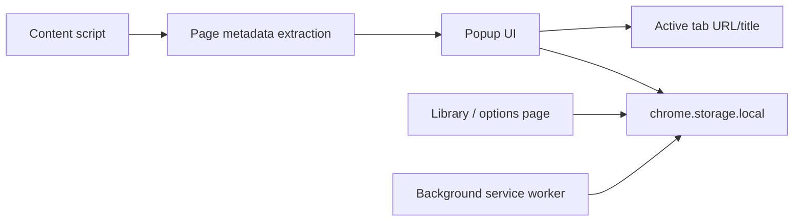

# Novel Tracker Extension

Novel Tracker is a lightweight Manifest V3 browser extension for saving and
updating web novel reading progress across chapter sites such as Webnovel,
Wuxiaworld, NovelBin, and similar pages.

## Status

MVP browser extension. It is designed around local-first tracking rather than a
cloud account: the extension stores reading state in `chrome.storage.local` and
lets the user manually correct imperfect site metadata.

## What It Does

- Save the current chapter URL from the active tab
- Capture title, source site, chapter label, cover image URL, and reading status
- Update saved progress from the popup
- Automatically update tracked novels when matching chapter URLs change
- Browse, search, filter, edit, and delete saved novels from the library page
- Reopen the exact chapter URL where reading stopped
- Keep all data local to the browser profile

## Extension Architecture



The popup captures the active tab, the content script helps infer metadata from
the current page, and the options page acts as the searchable library/editor.

## Stack

- Manifest V3 browser extension
- Plain JavaScript, HTML, and CSS
- `chrome.storage.local` for persistence
- Custom Node build script
- Node test runner for storage behavior

## Repository Layout

```text
src/
  manifest.json
  popup.html / popup.js
  options.html / options.js
  background.js
  content-script.js
  lib/
    site-metadata.js
    storage.js
scripts/
  build.mjs
  generate-icons.mjs
tests/
  storage.test.mjs
```

## Local Development

Build the extension:

```bash
npm run build
```

The unpacked extension is written to `dist/`.

Run tests:

```bash
npm test
```

## Load In Chrome Or Edge

1. Open `chrome://extensions` or `edge://extensions`.
2. Enable Developer Mode.
3. Choose `Load unpacked`.
4. Select the generated `dist/` folder.

## Design Notes

Novel sites expose inconsistent metadata, so the extension treats automatic
detection as a convenience rather than a source of truth. The library view keeps
manual editing available so users can fix titles, chapter labels, cover images,
or status when a site does something unusual.

## Limitations

- Metadata extraction varies by site.
- Data sync across browser profiles is not implemented.
- There is no remote backup service.
- Store packaging has not been completed yet.
