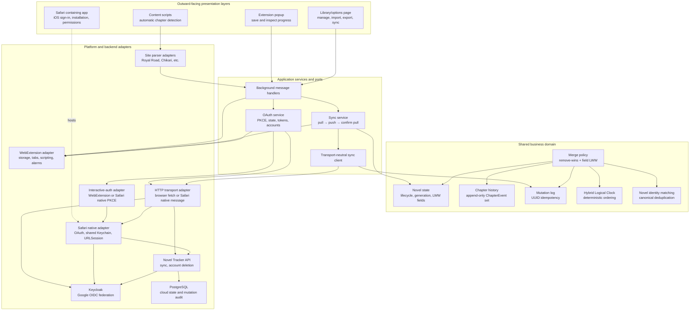

# Platform architecture

Novel Tracker keeps reading behavior independent of the browser that hosts it.

## System map

Arrows crossing into the shared domain carry plain objects rather than browser
objects, HTTP responses, or native types. Platform adapters may change without
changing the merge rules or persisted domain model.

## Shared domain

`sync-core.js`, `sync-policy.js`, and the state transformations in
`sync-client.js` implement novel identity, mutations, Hybrid Logical Clocks,
deterministic merging, and history without Chrome, Firefox, or Safari API calls.
They operate on plain data and can be used unchanged by every client.

OAuth protocol behavior is also shared in `src/lib/auth.js`: PKCE generation,
state validation, token exchange, refresh, account switching, and persisted
session state do not depend on a particular browser.

## Platform boundary

`src/lib/extension-api.js` is the narrow WebExtension API compatibility layer.
`src/lib/auth-platform.js` selects one of two interactive authorization
adapters:

- Chrome and Firefox use the WebExtension `identity` API.
- macOS Safari asks its native app extension to present
  `ASWebAuthenticationSession` and return the verified callback.
- On iOS/iPadOS, the containing app presents `ASWebAuthenticationSession` on
  first launch. The Safari extension imports the resulting session from a
  shared Keychain access group because an extension process has no dependable
  presentation window.

`src/lib/platform-http.js` provides a separate outbound HTTP port. Chrome and
Firefox use `fetch`; Safari sends allowlisted HTTPS requests through its native
extension because Safari may reject extension-origin calls to authentication
and API hosts. Neither adapter can read or merge the library.

## Generated Safari application

Apple's converter generates the Xcode application and extension targets. The
generated Swift sources are placeholders, so the release script replaces the
app controller and extension handler with maintained implementations under
`safari-native/`, adds the callback URL scheme, and configures shared Keychain
entitlements.

`npm run package:safari` always converts into a temporary directory and emits a
versioned Xcode-project ZIP under `release/`. This prevents regeneration from
overwriting developer-team, signing, or other local settings in an existing
Xcode project.

The native boundary exposes only OAuth authorization, shared-session
read/write/clear, and HTTPS requests restricted to the Novel Tracker Keycloak
and API hosts. Tokens are stored in the Keychain with this-device-only
accessibility. Sync sequencing, conflict resolution, and novel behavior remain
in the shared JavaScript domain and application layers.
